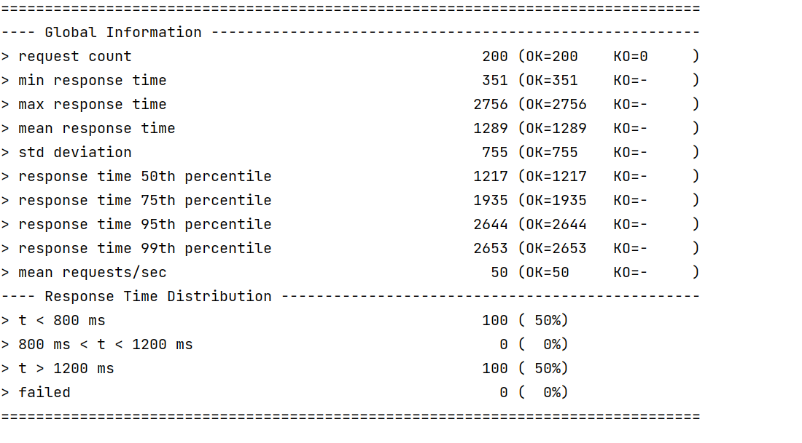
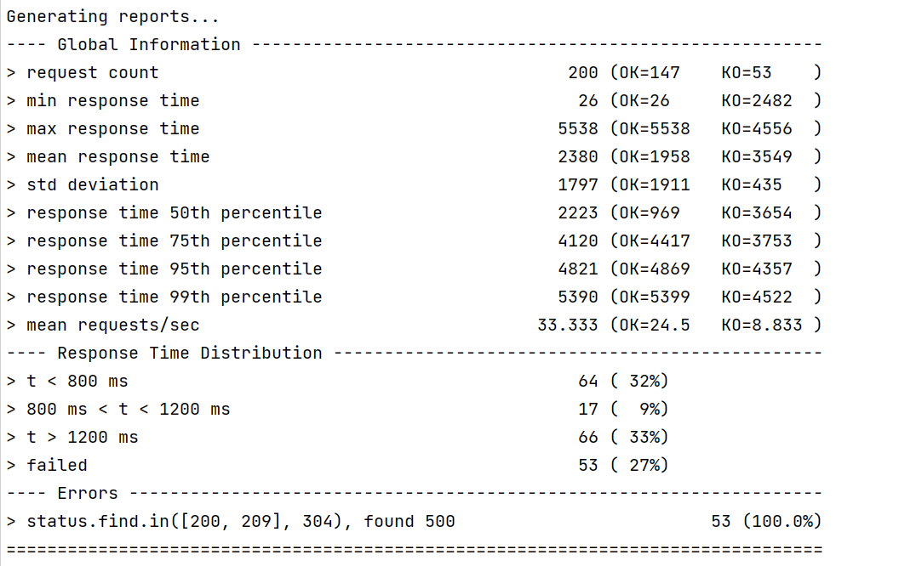

# 垂直扩展实验
指定参数`--cpus=0.5,1,2`

| CPUS | 并发数 | 平均延迟 |
| ---- | ------ | -------- |
| 0.5  | 200    | 4828     |
| 1    | 200    | 2617     |
| 2    | 200    | 954      |

# 水平扩展实验

固定参数`--cpus=1`开启3个容器
| 容器数 | 并发数 | 平均延迟 |
| ------ | ------ | -------- |
| 1      | 200    | 3019     |
| 2      | 200    | 1505     |
| 3      | 200    | 1236     |

# Redis实验




# WebPOS

The demo shows a web POS system , which replaces the in-memory product db in aw03 with a one backed by 京东.


To run

```shell
mvn clean spring-boot:run
```

Currently, it creates a new session for each user and the session data is stored in an in-memory h2 db. 
And it also fetches a product list from jd.com every time a session begins.

1. Build a docker image for this application and performance a load testing against it.
2. Make this system horizontally scalable by using haproxy and performance a load testing against it.
3. Take care of the **cache missing** problem (you may cache the products from jd.com) and **session sharing** problem (you may use a standalone mysql db or a redis cluster). Performance load testings.

Please **write a report** on the performance differences you notices among the above tasks.

